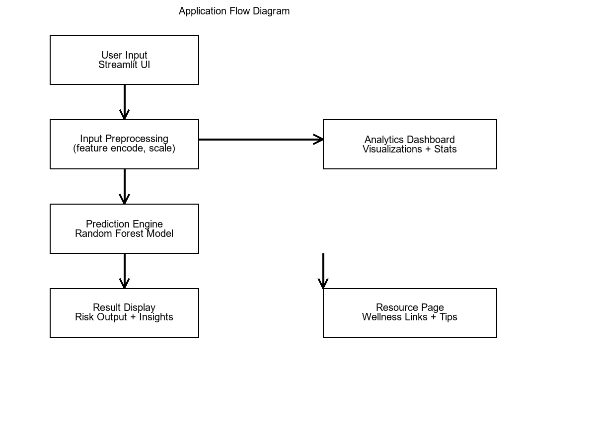
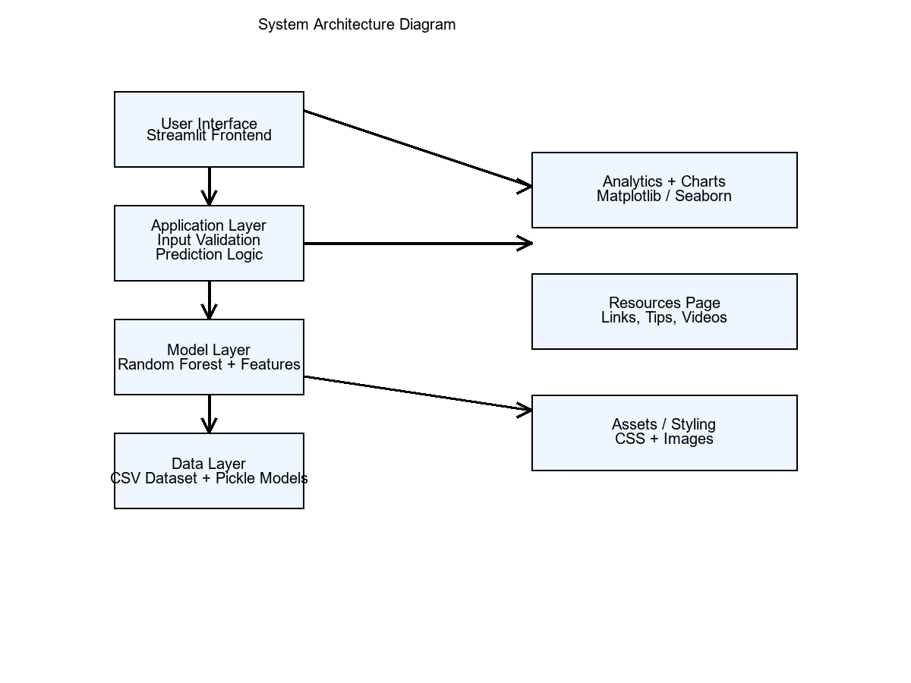

[![Contributors][contributors-shield]][contributors-url]
[![Forks][forks-shield]][forks-url]
[![Stargazers][stars-shield]][stars-url]
[![Issues][issues-shield]][issues-url]

 

  
  <h3 align="center">Student Mental Health Analysis & Prediction</h3>

  

    A machine learning–powered application for predicting student mental health risk and providing personalized wellness insights.
  

---

## About the Project

The **Student Mental Health Analysis & Prediction System** is a machine learning–based web application that predicts whether a student is at mental health risk based on factors such as depression, anxiety, panic attacks, CGPA, and treatment history.

The project includes:

- A **Streamlit-based multi-page interface**
- A trained **Random Forest Classifier**
- A **visual analysis dashboard** with risk factors
- A **solutions page** providing curated wellness resources (yoga & meditation videos)
- A fully customized UI using an external **CSS file**

This system aims to support early identification of mental health risks among students and provide actionable steps for improvement.

---

## Built With

- 
- 
- 
- 
- 

(<a href="#readme-top">back to top</a>)

---

## Project Structure

STUDENT*MENTAL_HEALTH_ANALYSIS/
│
├── app.py # Home page
│
├── pages/
│ ├── 1*🧠*Quick_Assessment.py # Assessment form
│ ├── 2*📊*Analysis.py # Analysis & visualizations
│ └── 3*🌿_Solutions.py # Wellness resources
│
├── assets/
│ ├── student_mental.png # Home page image/logo
│ └── style.css # Custom UI styling
│
├── random_forest_model.pkl # Trained ML model
├── model_columns.pkl # Training feature columns
├── logistic_model.pkl # Secondary model (optional)
│
├── student-mental-health.csv # Dataset
├── Student_Mental_Health_Analysis.ipynb # EDA & model training notebook
└── README.md # Documentation

(<a href="#readme-top">back to top</a>)

---

## Flow Diagram

  

_(Replace with your actual flowchart image if available.)_

---

## ER / Architecture Diagram

  

_(Replace with actual architecture diagram if available.)_

---

## Key Features

### 1. Quick Assessment

A short form capturing:

- Gender
- Course
- CGPA
- Depression
- Anxiety
- Panic attacks
- Treatment history

### 2. AI-Based Prediction

A **Random Forest classifier** predicts:

- At Risk
- Not At Risk

### 3. Visual Analysis Dashboard

Includes:

- Risk probability
- Risk factor breakdown
- Feature importance chart
- Personalized insights

### 4. Wellness Resources

Curated content to help students improve mental well-being:

- Meditation
- Breathing exercises
- Yoga routines

---

## Installation

### Step 1: Install Dependencies

pip install streamlit pandas numpy scikit-learn matplotlib seaborn joblib

### Step 2: Run Application

streamlit run app.py

### Step 3: Open in Browser

http://localhost:8501

(<a href="#readme-top">back to top</a>)

---

## Contributors

---

## License

Distributed for academic and research purposes.

---

## Contact

**Tanushka Tiwari**  
Computer Science Engineering  
Machine Learning & Web Application Development

LinkedIn: https://www.linkedin.com/in/tanushka-tiwari2105/
 
GitHub: https://github.com/tanushkat96

(<a href="#readme-top">back to top</a>)

---

<!-- Badge Links -->

[contributors-shield]: https://img.shields.io/github/contributors/tanushkat96/Student_Mental_health_predictor.svg?style=for-the-badge
[contributors-url]: https://github.com/tanushkat96/Student_Mental_health_predictor/graphs/contributors
[forks-shield]: https://img.shields.io/github/forks/tanushkat96/Student_Mental_health_predictor.svg?style=for-the-badge
[forks-url]: https://github.com/tanushkat96/Student_Mental_health_predictor/network/members
[stars-shield]: https://img.shields.io/github/stars/tanushkat96/Student_Mental_health_predictor.svg?style=for-the-badge
[stars-url]: https://github.com/tanushkat96/Student_Mental_health_predictor/stargazers
[issues-shield]: https://img.shields.io/github/issues/tanushkat96/Student_Mental_health_predictor.svg?style=for-the-badge
[issues-url]: https://github.com/tanushkat96/Student_Mental_health_predictor/issues
